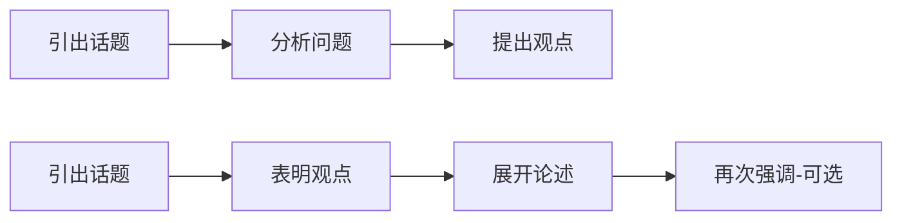

# 言语理解

## 行文逻辑

给一段话，问这段话的核心主旨是什么。

解题思路有以下：

### 行文脉络

常见的行文脉络如下：

解题方案：

1. 读头两句，查找是否有表明观点；
2. 读尾句，查找<mark>结论性论述词</mark>：<mark>因此、可见、所以、应该、需要、不能</mark>

### 转折关系

查找<mark>转折词</mark>：

- “但”：<mark>但是、实际上、但、可是</mark>
- “然而”：<mark>然而、其实不然</mark>
- 对比：<mark>通过对比、相比之下、经过对比</mark>

> 转折词的<mark>后面</mark>是文段的重点！

### 因果关系

查找<mark>因果词</mark>：

- “因为”：<mark>因为、因此、因而、由于</mark>
- “导致”：<mark>造成、导致、以至于</mark>

因果关系的格式主要是2种：

- 因为A，所以B
- 之所以B，是因为A

> 因果关系重点都是B！

没有提到B的选项都是错误选项。

### 并列关系

常用<mark>并列词</mark>：

- 既又：<mark>既…又…、又…又…、有时…有时…、一方面…另一方面…、…此外…</mark>
- 不是而是：<mark>是…不是…、不是…而是…</mark>
- 分号：`;`

> 如果并列前后提的是<mark>不同话题</mark>，就要<mark>全面概括</mark>；如果提的是<mark>相同话题</mark>，就要<mark>提取共性</mark>。

表述片面的选项都是错误选项。

### 递进关系

常用<mark>递进词</mark>：

- “更”：<mark>更、特别、尤其、重要的是、关键是、核心是、甚至</mark>
- 不但而且：<mark>不但…而且…、不仅…还…</mark>

> 递进关系下<mark>最后一段</mark>是文段重点！

### 条件关系

常用<mark>条件词</mark>：

- 如果：<mark>只要、只有、除非</mark>
- 必须：<mark>必须、务必、必要</mark>

> 条件关系中，<mark>条件是重点</mark>！

### 反面论证

常用<mark>反面论证关系词</mark>：

如果：<mark>一旦、倘若…可能…、如果不…那么…、否则</mark>

> 在反面论证中，反面论证不重要，<mark>对策是重点</mark>！

### 时空分析

也是一种比较关系，强调的是<mark>后半部分</mark>。

- <mark>过去…现在…</mark>
- <mark>传统…现代…</mark>
- <mark>美国…中国…</mark>

## 选词填空

### 程度轻重

可供填空的词在<mark>程度</mark>上有差别